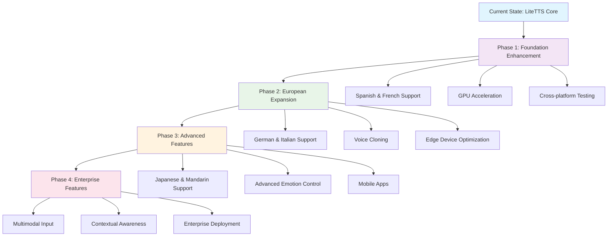

# Future Development & Testing Roadmap

---
**📚 LiteTTS Documentation Navigation**

**Core Documentation:** [Features](FEATURES.md) | [Configuration](CONFIGURATION.md) | [Performance](PERFORMANCE.md) | [Monitoring](MONITORING.md) | [Testing](TESTING.md) | [Troubleshooting](TROUBLESHOOTING.md)

**Setup & Usage:** [Dependencies](DEPENDENCIES.md) | [Quick Start](usage/QUICK_START_COMMANDS.md) | [Docker Deployment](usage/DOCKER-DEPLOYMENT.md) | [OpenWebUI Integration](usage/OPENWEBUI-INTEGRATION.md)

**Advanced:** [API Reference](api/API_REFERENCE.md) | [Development](development/README.md) | [Voice System](voices/README.md) | [Watermarking](WATERMARKING.md)

**Project:** [Changelog](CHANGELOG.md) | [Roadmap](ROADMAP.md) | [Contributing](CONTRIBUTIONS.md) | [Beta Features](BETA_FEATURES.md)

---

Comprehensive roadmap for cross-platform testing, performance optimization, and AI integration enhancements for the Kokoro ONNX TTS API.

## 🌍 Multi-Language Support Roadmap

### Phase 1: Foundation Languages

**Spanish (es-ES, es-MX):**
- Target: 8-12 high-quality voices (4 male, 4-8 female)
- Native speaker partnerships with Spanish TTS communities
- Regional accent support for Spain and Mexico variants
- Priority: High (Next Major Release)

**French (fr-FR, fr-CA):**
- Target: 6-10 voices with French and Canadian French variants
- Collaboration with Université de Montréal and French research institutions
- Priority: High (Next Major Release)

### Phase 2: European Expansion

**German (de-DE):**
- Target: 6-8 voices with standard German pronunciation
- Integration with existing German voice datasets
- Priority: Medium (Future Release)

**Italian (it-IT):**
- Target: 4-6 voices focusing on standard Italian
- Priority: Medium (Future Release)

### Phase 3: Asian Languages

**Japanese (ja-JP):**
- Target: 10-15 voices (LiteTTS heritage language - highest priority)
- Advanced pitch accent and intonation modeling
- Priority: High (Future Major Release)

**Mandarin Chinese (zh-CN):**
- Target: 8-12 voices with tone accuracy focus
- Large-scale dataset integration with tone validation
- Priority: High (Future Major Release)

### Critical Requirements for All Languages

- **Native Speaker Validation**: Every voice must be validated by native speakers
- **Phonetic Accuracy**: Language-specific phoneme models and pronunciation rules
- **Cultural Sensitivity**: Appropriate voice characteristics for each culture
- **Quality Threshold**: Minimum MOS (Mean Opinion Score) of 4.0/5.0

### Community Contribution Pipeline

1. **Voice Donation Program**: Native speakers can contribute voice samples
2. **Quality Assurance**: Multi-stage validation process
3. **Training Infrastructure**: Automated voice model training system
4. **Beta Testing**: Community testing before public release
5. **Feedback Integration**: Continuous improvement based on user feedback

### Technical Implementation

- **Voice Dataset Requirements**: Minimum 10 hours of high-quality audio per voice
- **Training Infrastructure**: GPU cluster for voice model training
- **Quality Metrics**: Automated quality assessment and human validation
- **Integration Testing**: Cross-language compatibility and performance validation

## 🚀 Technical Enhancements

### Performance Optimization

**GPU Acceleration:**
- CUDA support for NVIDIA GPUs
- Metal support for Apple Silicon
- OpenCL support for AMD GPUs
- Performance benchmarks and optimization

**Model Quantization:**
- INT8 quantization for faster inference
- INT4 quantization for edge deployment
- Dynamic quantization for optimal performance
- Quality vs. speed trade-off analysis

**Streaming Optimization:**
- Real-time audio streaming with lower latency
- Chunked processing for long texts
- WebSocket support for live applications
- Adaptive bitrate streaming

**Edge Computing:**
- ARM64 optimization for Raspberry Pi
- Mobile device deployment (iOS/Android)
- WebAssembly support for browsers
- Offline operation capabilities

### Advanced Features

**Voice Cloning:**
- Zero-shot voice cloning with ethical safeguards
- Few-shot voice adaptation
- Voice style transfer capabilities
- Consent and authentication systems

**Emotion Control:**
- Fine-grained emotional expression in speech
- Emotion intensity control
- Context-aware emotion selection
- Multi-dimensional emotion modeling

**Contextual Awareness:**
- Context-aware pronunciation and emphasis
- Document-level prosody modeling
- Speaker adaptation based on content
- Intelligent punctuation handling

**Multimodal Input:**
- Integration with text, audio, and visual inputs
- Image-to-speech description
- Video narration capabilities
- Cross-modal content understanding

## 🧪 Cross-Platform Testing

### Target Platforms

**Desktop Operating Systems:**
- **macOS**: Intel and Apple Silicon optimization
- **Windows**: DirectML acceleration support
- **Linux**: Multiple distributions (Ubuntu, CentOS, Arch)
- **FreeBSD**: Unix compatibility testing

**Mobile Platforms:**
- **iOS**: Native app integration
- **Android**: APK and AAB deployment
- **Progressive Web Apps**: Cross-platform web deployment

**Edge Devices:**
- **Raspberry Pi**: ARM64 optimization and testing
- **NVIDIA Jetson**: GPU-accelerated edge deployment
- **Intel NUC**: Compact deployment scenarios
- **Custom Hardware**: Embedded system integration

**Cloud Platforms:**
- **AWS**: EC2, Lambda, and container deployment
- **Google Cloud**: Compute Engine and Cloud Run
- **Microsoft Azure**: Virtual machines and container instances
- **Docker**: Multi-architecture container support

### Quality Assurance

**Automated Testing:**
- Continuous integration pipelines for all platforms
- Automated performance benchmarking
- Cross-platform compatibility testing
- Regression testing for each release

**Performance Benchmarking:**
- Standardized performance metrics across platforms
- Real-time factor (RTF) measurements
- Memory usage profiling
- CPU utilization analysis

**Community Testing:**
- Beta testing program for early feedback
- Platform-specific testing groups
- User acceptance testing
- Bug bounty program for critical issues

## 🔬 Research & Development

### AI/ML Improvements

**Model Architecture:**
- Transformer-based improvements
- Attention mechanism optimization
- Multi-speaker model development
- Cross-lingual transfer learning

**Training Techniques:**
- Self-supervised learning approaches
- Few-shot learning for new voices
- Adversarial training for robustness
- Federated learning for privacy

**Quality Enhancement:**
- Neural vocoder improvements
- Prosody modeling advances
- Naturalness optimization
- Intelligibility enhancement

### Ethical AI Development

**Responsible AI:**
- Bias detection and mitigation
- Fairness across demographics
- Transparency in AI decisions
- Explainable AI features

**Privacy Protection:**
- On-device processing options
- Differential privacy techniques
- Data minimization strategies
- User consent management

**Security Measures:**
- Adversarial attack resistance
- Model watermarking
- Secure model deployment
- Authentication and authorization

## 📋 Development Phases Summary

### Phase Overview Table

| Phase | Focus Area | Key Features | Priority | Dependencies |
|-------|------------|--------------|----------|--------------|
| **Phase 1** | Foundation Enhancement | Multi-language, GPU acceleration | High | Current core system |
| **Phase 2** | European Expansion | Additional languages, voice cloning | Medium | Phase 1 completion |
| **Phase 3** | Advanced Features | Asian languages, emotion control | High | Phase 2 completion |
| **Phase 4** | Enterprise Features | Multimodal, enterprise deployment | Medium | Phase 3 completion |

### Detailed Phase Breakdown

#### Phase 1: Foundation Enhancement
- **Spanish and French language support** - Expand to major European languages
- **GPU acceleration implementation** - Performance optimization for production
- **Cross-platform testing infrastructure** - Ensure reliability across platforms

#### Phase 2: European Expansion
- **German and Italian language support** - Complete European language coverage
- **Voice cloning capabilities** - Advanced voice synthesis features
- **Edge device optimization** - Mobile and embedded device support

#### Phase 3: Advanced Features
- **Japanese and Mandarin Chinese support** - Asian language expansion
- **Advanced emotion control** - Enhanced expressiveness
- **Production-ready mobile apps** - Native mobile applications

#### Phase 4: Enterprise Features
- **Multimodal input support** - Text and audio input processing
- **Advanced contextual awareness** - Context-aware synthesis
- **Enterprise deployment features** - Scalable enterprise solutions

## 🤝 Community Involvement

### Contribution Opportunities

**Voice Contributions:**
- Native speaker voice donations
- Accent and dialect variations
- Quality validation and testing
- Cultural adaptation feedback

**Technical Contributions:**
- Code contributions and bug fixes
- Performance optimization
- Platform-specific improvements
- Documentation enhancements

**Research Collaboration:**
- Academic partnerships
- Industry collaborations
- Open-source research projects
- Conference presentations

### Support and Resources

**Developer Resources:**
- Comprehensive API documentation
- SDK development for multiple languages
- Tutorial and example projects
- Developer community forums

**User Support:**
- User guides and tutorials
- Video demonstrations
- Community support channels
- Professional support options

## 📊 Success Metrics

### Technical Metrics
- **Performance**: RTF < 0.2 across all platforms
- **Quality**: MOS > 4.0 for all voices
- **Reliability**: 99.9% uptime for production deployments
- **Scalability**: Support for 1000+ concurrent users

### Community Metrics
- **Language Coverage**: 10+ languages (Long-term Goal)
- **Voice Variety**: 200+ voices across all languages
- **User Adoption**: 10,000+ active users
- **Community Contributions**: 100+ contributors

### Business Metrics
- **Market Penetration**: Leading open-source TTS solution
- **Enterprise Adoption**: 50+ enterprise deployments
- **Research Impact**: 10+ academic citations
- **Industry Recognition**: Awards and recognition

This roadmap represents our commitment to making Kokoro ONNX TTS API the most comprehensive, accessible, and high-quality text-to-speech solution available.
