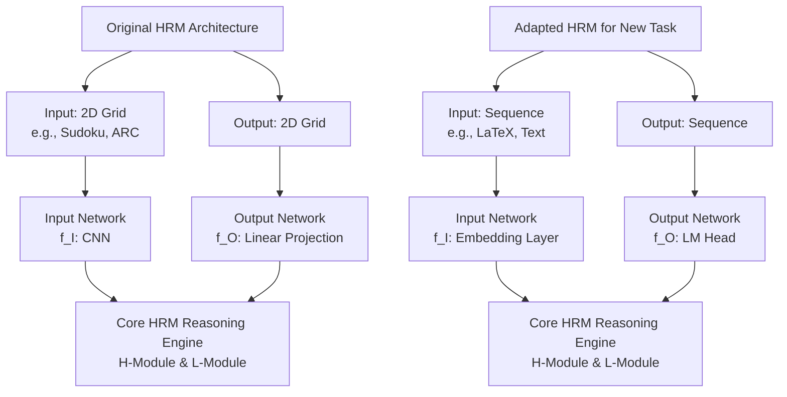

Of course. This is an excellent project that blends cutting-edge research with practical engineering. Here is a comprehensive, actionable plan structured like a technical project roadmap.

## Project: Building a Specialized HRM-Based Reasoning Engine

### **Phase 0: Foundation & Environment Setup (Sprint 0)**

**Objective:** Establish a reproducible and monitored development environment.

**Actions:**
1.  **Hardware Provisioning:** Designate **PC #2 (RTX 5060 TI)** as the primary development machine. Ensure it has a clean NVIDIA driver installation and at least 500GB of free SSD space for datasets.
2.  **Software Environment:**
    *   **OS:** Ubuntu 22.04 LTS (Recommended for best CUDA support) or Windows 11 WSL2.
    *   **Core Stack:**
        ```bash
        # Install Python 3.10 and essential tools

---
**📚 LiteTTS Documentation Navigation**

**Core Documentation:** [Features](../../FEATURES.md) | [Configuration](../../CONFIGURATION.md) | [Performance](../../PERFORMANCE.md) | [Monitoring](../../MONITORING.md) | [Testing](../../TESTING.md) | [Troubleshooting](../../TROUBLESHOOTING.md)

**Setup & Usage:** [Dependencies](../../DEPENDENCIES.md) | [Quick Start](../../usage/QUICK_START_COMMANDS.md) | [Docker Deployment](../../usage/DOCKER-DEPLOYMENT.md) | [OpenWebUI Integration](../../usage/OPENWEBUI-INTEGRATION.md)

**Advanced:** [API Reference](../../api/API_REFERENCE.md) | [Development](../README.md) | [Voice System](../../voices/README.md) | [Watermarking](../../WATERMARKING.md)

**Project:** [Changelog](../../CHANGELOG.md) | [Roadmap](../../ROADMAP.md) | [Contributing](../../CONTRIBUTIONS.md) | [Beta Features](../../BETA_FEATURES.md)

---
        sudo apt update && sudo apt install python3.10 python3.10-venv python3.10-dev build-essential git-lfs
        # Install CUDA 12.1 Toolkit (from NVIDIA website)
        # Install PyTorch with CUDA 12.1 support as per official instructions
        pip3 install torch torchvision torchaudio --index-url https://download.pytorch.org/whl/cu121
        ```
3.  **Project Structure:**
    ```
    hrm_project/
    ├── data/               # Raw and processed datasets
    ├── experiments/        # Each training run gets its own folder (logs, checkpoints, configs)
    ├── src/                # Our code
    │   ├── hrm_core/      # Forked & modified HRM core library
    │   ├── training/      # Training scripts & utilities
    │   └── inference/     # API server & demo code
    ├── scripts/           # Automation scripts (download, train, eval)
    ├── docs/              # Project log, notes, and model cards
    └── requirements.txt
    ```
4.  **Monitoring:** Install and configure `weights & biases` (wandb) for experiment tracking. This is non-negotiable for managing multiple runs.

**Definition of Done:** A single script (`scripts/setup_environment.sh`) can be run on a fresh system to install all dependencies and verify the GPU is available to PyTorch.

---

### **Phase 1: Reconnaissance & Baseline (Sprint 1)**

**Objective:** Understand the existing HRM codebase and reproduce the reported results to establish a performance baseline.

**Actions:**
1.  **Fork & Explore:** Fork the `sapientinc/HRM` repository. Thoroughly read the code, focusing on:
    *   `hrm/model.py`: The core architecture.
    *   `hrm/training/trainer.py`: The custom training loop with deep supervision.
    *   `configs/`: The YAML configuration structure.
2.  **Reproduce Results:** Run the official evaluation scripts on the provided pre-trained models. Record the exact accuracy scores for ARC, Sudoku, and Maze. This is your **baseline**.
    ```bash
    bash scripts/download_pretrained.sh
    bash scripts/eval_arc_pretrained.sh
    # Log results to wandb and your docs/log.md
    ```
3.  **Dataset Acquisition:** Run the scripts to download all datasets. Explore their structure.
    ```bash
    bash scripts/download_arc.sh
    bash scripts/download_sudoku.sh
    bash scripts/download_maze.sh
    ```
4.  **Training Run:** Perform a full training run on the **Sudoku-Extreme** task (it's likely the fastest to converge). Aim to match the paper's ~99% accuracy.
    ```bash
    # This will take ~1-2 days on your RTX 5060 TI. Monitor with wandb.
    bash scripts/train_sudoku.sh
    ```

**Definition of Done:** A project log entry showing you have successfully reproduced the Sudoku-Extreme results (e.g., >98% accuracy) from scratch, with training curves logged in wandb.

---

### **Phase 2: Define Your Specialized Task (Sprint 2)**

**Objective:** Select and prepare a dataset for a novel task that exploits HRM's strengths.

**Task Selection Criteria:**
*   **Requires complex, multi-step reasoning.**
*   **Has a well-defined, verifiable output.**
*   **Available or can be synthesized as a dataset of 1k-10k high-quality examples.**

**Example Task Ideas:**

| Task | Description | Data Source | Input Format | Output Format |
| :--- | :--- | :--- | :--- | :--- |
| **Symbolic Math** | Solve integrals or derivatives. | Generate with SymPy. | LaTeX string of problem. | LaTeX string of solution. |
| **Logic Grid Puzzles** | Classic "Einstein's Riddle" style puzzles. | Web scrape or generate. | Natural language description of clues. | Grid of answers or final solution. |
| **Custom Game Solving** | Optimal moves for a defined board game. | Simulator + A* search. | Board state (e.g., 2D grid). | Next move coordinates. |
| **Resource Scheduling** | Optimize a simple weekly schedule. | Generate constraints. | List of tasks, durations, constraints. | A valid schedule (sequence). |

**Action:**
1.  **Choose one primary task** to focus on (e.g., Symbolic Math - Derivatives).
2.  **Create a data synthesis script** (`src/data/make_derivative_dataset.py`).
    ```python
    import sympy as sp
    import random
    import json

    def generate_derivative_sample():
        x = sp.symbols('x')
        # Generate a random function
        expr = random.choice([sp.sin(x), sp.cos(x), sp.exp(x), x**2, x**3]) * random.randint(1, 5)
        # Calculate its derivative
        derivative = sp.diff(expr, x)
        return {
            "input": sp.latex(expr),
            "output": sp.latex(derivative)
        }

    dataset = [generate_derivative_sample() for _ in range(10000)]
    with open('data/derivatives_10k.json', 'w') as f:
        json.dump(dataset, f)
    ```
3.  **Create a new dataset class** in `src/hrm_core/datasets/derivative.py` that loads this JSON and tokenizes the LaTeX strings.

**Definition of Done:** A finalized, cleaned dataset of 10,000 examples is in the `data/` folder, and a script exists to generate more.

---

### **Phase 3: Model Adaptation & Training (Sprint 3-4)**

**Objective:** Modify the HRM codebase to train on your custom task.

**Actions:**
1.  **Tokenization:** You are moving from grids to sequences (LaTeX strings). You will need to:
    *   Define a custom vocabulary (e.g., `['0', '1', ..., 'x', '\\sin', ...]`).
    *   Create a custom tokenizer class (`src/hrm_core/tokenizer.py`) to map strings to token IDs.
2.  **Architecture Mods:** The input (`f_I`) and output (`f_O`) networks will need to change to handle the sequence-to-sequence nature of the task.
    *   `f_I` will become an embedding layer for your token IDs.
    *   `f_O` will need to output a probability distribution over your vocabulary for each token position.
3.  **Configuration:** Create a new config file `configs/derivative_config.yaml`. Key changes:
    ```yaml
    data:
      name: "derivative" # Your new dataset class
      vocab_size: 128 # Size of your custom vocabulary
      max_seq_len: 64 # Longest sequence you expect
    model:
      input_net: "embedding" # Changed from CNN for grids
      output_net: "lm_head"  # Language modeling head
    training:
      loss: "cross_entropy" # Standard for token prediction
    ```
4.  **Hyperparameter Tuning:** Use wandb sweeps to find good initial learning rates, batch sizes, and cycle lengths (`N` and `T`) for your new task.
5.  **Train!** Launch extended training runs, using the deep supervision and ACT mechanism.

**Definition of Done:** An HRM model that achieves >90% accuracy on a held-out test set of your custom task.

---
### Phase 3 Architecture Modification Overview


---

### **Phase 4: Deployment & API Creation (Sprint 5)**

**Objective:** Package the trained model into a usable service.

**Actions:**
1.  **Export Model:** Write a script to export your trained PyTorch model to a more inference-friendly format like `TorchScript` or `ONNX`. (Note: The custom ops might make this tricky. A fallback is to use the pure PyTorch model).
2.  **Build an API Server:** Create a `src/inference/api_server.py` using **FastAPI**.
    ```python
    from fastapi import FastAPI
    from pydantic import BaseModel
    from src.inference.predictor import HRMPredictor

    app = FastAPI()
    predictor = HRMPredictor("experiments/derivative_model_best/checkpoint.pt")

    class PredictionRequest(BaseModel):
        input_sequence: str

    @app.post("/predict")
    def predict(request: PredictionRequest):
        # Tokenize input, run model, detokenize output
        result = predictor.predict(request.input_sequence)
        return {"result": result}
    ```
3.  **Containerize:** Create a `Dockerfile` to package the API, model, and all dependencies into a container. This ensures it runs anywhere.
4.  **Benchmark:** Use a tool like `locust` to performance-test your API endpoint under load. Measure tokens/second and latency on your RTX 5060 TI.

**Definition of Done:** A Docker container that can be run with `docker run -p 8000:8000 my-hrm-api`, and a documented `/predict` endpoint that returns correct answers.

---

### **Phase 5: Advanced Integration (The "LLM Co-Processor" Vision) (Sprint 6+)**

**Objective:** Connect your specialized HRM engine to a general-purpose LLM.

**Actions:**
1.  **Choose an LLM:** Select a small, efficient LLM that can run on your PC #1 (e.g., `Phi-3` or `Qwen2-7B`). Quantize it to 4-bit using `llama.cpp` or `AutoGPTQ`.
2.  **Develop a "Tool Use" Prompt:** Craft a system prompt that instructs the LLM on when and how to use the HRM tool.
    *   **Example:** *"You are a helpful assistant. You have access to a special tool that can solve complex symbolic math problems. When the user asks a calculus question, you must call the `calculate_derivative` tool with the correct input."*
3.  **Build the Integration:** Use a framework like `LangChain` or `LiteLLM` to create an agentic workflow:
    1.  LLM receives user query: "What's the derivative of sin(5x)?"
    2.  LLM decides to call the tool `calculate_derivative` with input `"sin(5x)"`.
    3.  Your code calls your local HRM API endpoint.
    4.  HRM returns `"5*cos(5x)"`.
    5.  LLM formulates the final answer: "The derivative of sin(5x) is 5*cos(5x)."

**Definition of Done:** A demo script where a user asks a natural math question to a local LLM, which correctly triggers your HRM API and returns a final, correct answer.

---

### **Project Log / Scrum Board Setup**

Use a tool like **Trello, Jira, or GitHub Projects**. Create these columns: `Backlog`, `Sprint Ready`, `In Progress`, `Review/Test`, `Done`.

**Sample Initial Tasks for your Backlog:**
*   [ ] Task: Create and run `setup_environment.sh` script.
*   [ ] Task: Document successful pre-trained model evaluation results (ARC, Sudoku, Maze).
*   [ ] Task: Complete one full training run for Sudoku-Extreme.
*   [ ] Task: Research and select primary custom task.
*   [ ] Task: Develop data synthesis script for custom task (10k samples).
*   [ ] Task: Implement custom dataset class and tokenizer.
*   [ ] Bug: Investigate OOM error when batch size > 16.
*   [ ] Epic: Integrate with Ollama as a dynamic tool. (Future)

This plan is ambitious but structured. Each sprint delivers a tangible outcome, moving from replication to innovation. Good luck, and remember to log everything!
