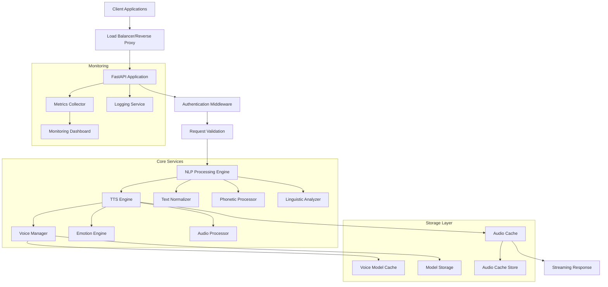

# Design Document

---
**📚 LiteTTS Documentation Navigation**

**Core Documentation:** [Features](../../FEATURES.md) | [Configuration](../../CONFIGURATION.md) | [Performance](../../PERFORMANCE.md) | [Monitoring](../../MONITORING.md) | [Testing](../../TESTING.md) | [Troubleshooting](../../TROUBLESHOOTING.md)

**Setup & Usage:** [Dependencies](../../DEPENDENCIES.md) | [Quick Start](../../usage/QUICK_START_COMMANDS.md) | [Docker Deployment](../../usage/DOCKER-DEPLOYMENT.md) | [OpenWebUI Integration](../../usage/OPENWEBUI-INTEGRATION.md)

**Advanced:** [API Reference](../../api/API_REFERENCE.md) | [Development](../README.md) | [Voice System](../../voices/README.md) | [Watermarking](../../WATERMARKING.md)

**Project:** [Changelog](../../CHANGELOG.md) | [Roadmap](../../ROADMAP.md) | [Contributing](../../CONTRIBUTIONS.md) | [Beta Features](../../BETA_FEATURES.md)

---

## Overview

The Kokoro ONNX TTS API is designed as a high-performance, lightweight text-to-speech service built around the Kokoro ONNX runtime. The architecture emphasizes low latency, minimal resource usage, and advanced linguistic processing capabilities while maintaining compatibility with OpenAI's API standards. The system employs a modular design with clear separation of concerns, enabling efficient processing, caching, and streaming of audio content.

## Architecture

### High-Level Architecture



### Service Architecture Layers

1. **API Layer**: FastAPI-based REST API with OpenAI compatibility
2. **Processing Layer**: NLP processing, TTS synthesis, and audio generation
3. **Caching Layer**: Voice model caching and audio response caching
4. **Storage Layer**: Model file management and temporary audio storage
5. **Monitoring Layer**: Metrics collection, logging, and health monitoring

## Components and Interfaces

### 1. API Gateway Component

**Purpose**: Handle HTTP requests, authentication, and response formatting

**Key Classes**:
- `TTSAPIRouter`: Main API endpoint router
- `RequestValidator`: Input validation and sanitization
- `ResponseFormatter`: Output formatting and streaming
- `ErrorHandler`: Centralized error handling and logging

**Interfaces**:
```python
class TTSRequest:
    text: str
    voice: str = "heart"
    emotion: str = "neutral"
    emotion_strength: Optional[float] = None
    speed: float = 1.0
    response_format: str = "mp3"
    phonemize_between_brackets: bool = False

class TTSResponse:
    audio_data: bytes
    content_type: str
    duration: float
    processing_time: float
    metadata: Dict[str, Any]
```

### 2. NLP Processing Engine

**Purpose**: Advanced text normalization and linguistic processing

**Key Classes**:
- `TextNormalizer`: Handles numbers, dates, currency, abbreviations
- `HomographResolver`: Resolves ambiguous word pronunciations
- `PhoneticProcessor`: Processes custom pronunciation markers
- `SpellProcessor`: Handles spell() function calls
- `PunctuationAnalyzer`: Analyzes punctuation for prosody control

**Interfaces**:
```python
class NLPProcessor:
    def normalize_text(self, text: str) -> str
    def resolve_homographs(self, text: str) -> str
    def process_phonetics(self, text: str) -> str
    def handle_spell_functions(self, text: str) -> str
    def analyze_prosody(self, text: str) -> ProsodyInfo

class ProsodyInfo:
    pauses: List[PauseMarker]
    emphasis: List[EmphasisMarker]
    intonation: List[IntonationMarker]
```

### 3. TTS Engine Core

**Purpose**: Core text-to-speech synthesis using Kokoro ONNX

**Key Classes**:
- `KokoroTTSEngine`: Main TTS synthesis engine
- `VoiceManager`: Voice model loading and management
- `EmotionController`: Emotion weight calculation and application
- `AudioProcessor`: Audio post-processing and format conversion
- `ChunkProcessor`: Text chunking for long content

**Interfaces**:
```python
class TTSEngine:
    def synthesize(self, text: str, voice: str, emotion: float, speed: float) -> AudioData
    def load_voice(self, voice_name: str) -> VoiceEmbedding
    def apply_emotion(self, audio: AudioData, emotion: float) -> AudioData
    def adjust_speed(self, audio: AudioData, speed: float) -> AudioData

class AudioData:
    samples: np.ndarray
    sample_rate: int
    duration: float
    format: str
```

### 4. Caching System

**Purpose**: Optimize performance through intelligent caching

**Key Classes**:
- `VoiceCache`: In-memory voice embedding cache
- `AudioCache`: LRU cache for generated audio segments
- `TextCache`: Cache for processed/normalized text
- `CacheManager`: Unified cache management and cleanup

**Interfaces**:
```python
class CacheManager:
    def get_cached_audio(self, cache_key: str) -> Optional[AudioData]
    def cache_audio(self, cache_key: str, audio: AudioData, ttl: int)
    def get_voice_embedding(self, voice_name: str) -> Optional[VoiceEmbedding]
    def preload_voices(self, voice_names: List[str])
```

### 5. Voice Management System

**Purpose**: Efficient voice model downloading, loading, and management

**Key Classes**:
- `VoiceDownloader`: Downloads voice models from HuggingFace
- `VoiceValidator`: Validates voice model integrity
- `VoiceMetadata`: Manages voice metadata and categorization
- `VoiceSelector`: Intelligent voice selection and fallbacks

**Interfaces**:
```python
class VoiceManager:
    def download_voice(self, voice_name: str) -> Path
    def load_voice_embedding(self, voice_path: Path) -> VoiceEmbedding
    def get_voice_metadata(self, voice_name: str) -> VoiceMetadata
    def list_available_voices(self, filters: Dict[str, Any]) -> List[VoiceInfo]

class VoiceMetadata:
    name: str
    gender: str
    accent: str
    voice_type: str
    quality_rating: float
    language: str
    file_size: int
```

## Data Models

### Core Data Structures

```python
@dataclass
class TTSConfiguration:
    model_path: str
    voice_directory: str
    device: str
    sample_rate: int
    chunk_size: int
    cache_size: int
    max_text_length: int

@dataclass
class VoiceEmbedding:
    name: str
    embedding_data: np.ndarray
    metadata: VoiceMetadata
    loaded_at: datetime
    file_hash: str

@dataclass
class AudioSegment:
    audio_data: np.ndarray
    sample_rate: int
    duration: float
    format: str
    metadata: Dict[str, Any]

@dataclass
class ProcessingMetrics:
    request_id: str
    text_length: int
    processing_time: float
    audio_duration: float
    voice_used: str
    cache_hit: bool
    error_count: int
```

### Database Schema (Optional SQLite for Metrics)

```sql
CREATE TABLE request_metrics (
    id INTEGER PRIMARY KEY AUTOINCREMENT,
    request_id TEXT UNIQUE,
    timestamp DATETIME DEFAULT CURRENT_TIMESTAMP,
    text_length INTEGER,
    processing_time REAL,
    audio_duration REAL,
    voice_name TEXT,
    emotion TEXT,
    speed REAL,
    cache_hit BOOLEAN,
    error_message TEXT
);

CREATE TABLE voice_usage (
    voice_name TEXT,
    usage_count INTEGER DEFAULT 0,
    last_used DATETIME,
    PRIMARY KEY (voice_name)
);
```

## Error Handling

### Error Classification

1. **Client Errors (4xx)**:
   - Invalid input parameters
   - Unsupported voice or format
   - Text too long
   - Malformed requests

2. **Server Errors (5xx)**:
   - Model loading failures
   - Audio generation errors
   - Resource exhaustion
   - Internal processing errors

### Error Response Format

```python
class ErrorResponse:
    error: str
    message: str
    details: Optional[Dict[str, Any]]
    request_id: str
    timestamp: str

# Example error responses
{
    "error": "invalid_voice",
    "message": "Voice 'unknown_voice' is not available",
    "details": {
        "available_voices": ["heart", "puck", "alloy"],
        "requested_voice": "unknown_voice"
    },
    "request_id": "req_123456",
    "timestamp": "2024-01-15T10:30:00Z"
}
```

### Error Recovery Strategies

1. **Voice Fallback**: Automatically use default voice if requested voice fails
2. **Graceful Degradation**: Disable advanced features if they fail
3. **Retry Logic**: Implement exponential backoff for transient failures
4. **Circuit Breaker**: Prevent cascade failures in high-load scenarios

## Testing Strategy

### Unit Testing

1. **NLP Processing Tests**:
   - Text normalization accuracy
   - Homograph resolution
   - Phonetic processing
   - Spell function handling

2. **TTS Engine Tests**:
   - Audio generation quality
   - Emotion application
   - Speed adjustment
   - Voice switching

3. **API Endpoint Tests**:
   - Request validation
   - Response formatting
   - Error handling
   - Authentication

### Integration Testing

1. **End-to-End Workflows**:
   - Complete text-to-speech pipeline
   - Multi-voice processing
   - Streaming response handling
   - Cache integration

2. **Performance Testing**:
   - Latency benchmarks
   - Concurrent request handling
   - Memory usage optimization
   - Cache effectiveness

### Load Testing

1. **Stress Testing**:
   - High concurrent request loads
   - Large text processing
   - Memory leak detection
   - Resource exhaustion scenarios

2. **Performance Benchmarks**:
   - Sub-100ms latency targets
   - Throughput measurements
   - Resource utilization tracking
   - Cache hit rate optimization

### Quality Assurance

1. **Audio Quality Tests**:
   - Subjective listening tests
   - Objective audio metrics (SNR, THD)
   - Cross-voice consistency
   - Emotion accuracy validation

2. **Linguistic Accuracy Tests**:
   - Pronunciation correctness
   - Text normalization validation
   - Edge case handling
   - Multi-language support

## Performance Considerations

### Latency Optimization

1. **Model Preloading**: Load all voice embeddings at startup
2. **Request Pipelining**: Overlap text processing and audio generation
3. **Streaming Responses**: Start audio streaming before complete generation
4. **Efficient Chunking**: Optimize chunk sizes for processing speed

### Memory Management

1. **Voice Embedding Cache**: Keep frequently used voices in memory
2. **Audio Buffer Management**: Efficient audio buffer allocation and reuse
3. **Garbage Collection**: Proactive cleanup of temporary audio data
4. **Memory Monitoring**: Track and alert on memory usage patterns

### Scalability Design

1. **Horizontal Scaling**: Stateless design for easy horizontal scaling
2. **Load Balancing**: Distribute requests across multiple instances
3. **Resource Isolation**: Separate CPU-intensive and I/O operations
4. **Async Processing**: Use async/await for non-blocking operations

### Caching Strategy

1. **Multi-Level Caching**:
   - L1: In-memory voice embeddings
   - L2: Processed text cache
   - L3: Generated audio segments cache

2. **Cache Invalidation**:
   - TTL-based expiration
   - LRU eviction policies
   - Manual cache clearing for updates

3. **Cache Warming**:
   - Preload common voices
   - Background processing of frequent requests
   - Predictive caching based on usage patterns